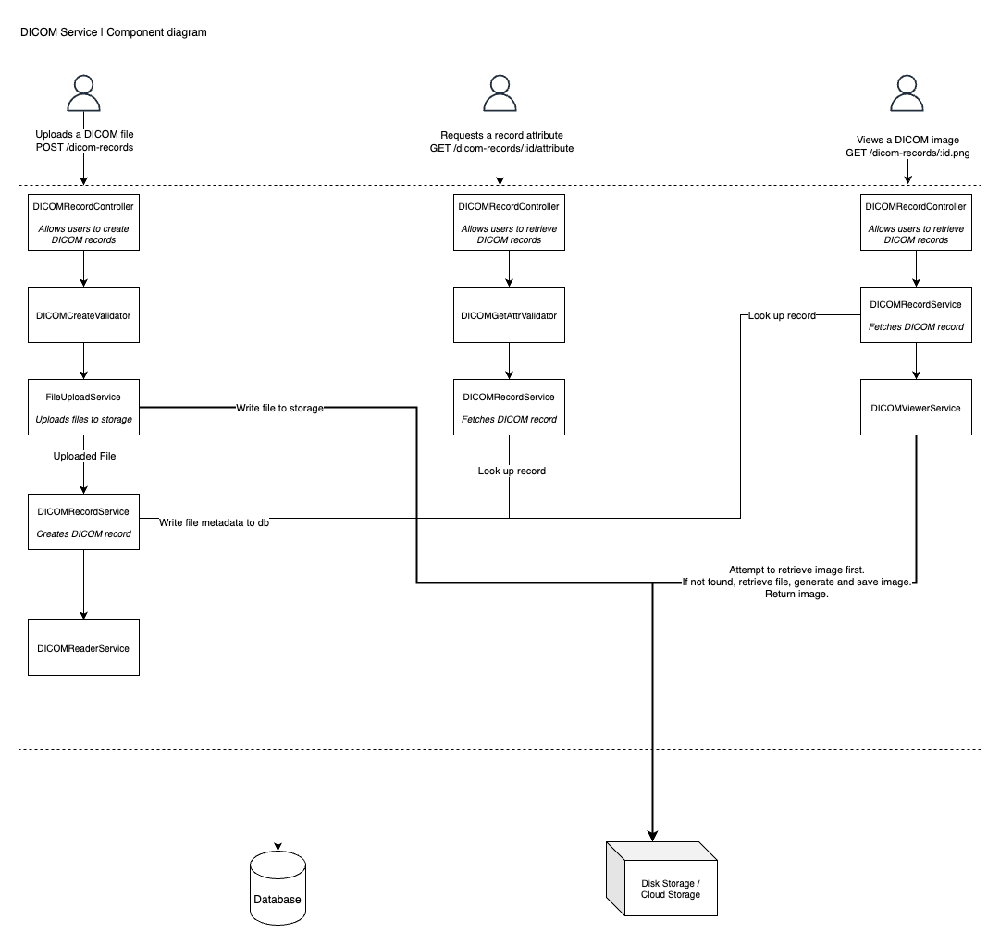

# DICOM service system design

We’re looking to design a microservice that is able to accept and store an uploaded DICOM file, extract and return any DICOM header attribute based on a DICOM Tag as a query parameter, and finally convert the file into a PNG for browser-based viewing.
Please design a RESTful API that exposes an interface for the functionality described above.

## Requirements

1. Accept and store an uploaded DICOM file
2. Extract and return any DICOM header attribute based on a DICOM Tag as a query parameter
3. Convert the file into a PNG for browser-based viewing

## Decisions

- Storing the DICOM file and accessing DICOM metadata should be two separate datastores. We want metadata retrieval to be quick and performant. They may also be additional internal data we want to attach with the metadata. I'll use a traditional database for metadata and a blob storage for the DICOM file itself.

- As mentioned above, fetching any metadata from the DICOM file should hit the database instead of retrieval the file itself. The list of attributes related to DICOM is quite lengthy. For the purposes of this interview, I'm going to skip trying to model all those attributes and just dump a few into the database.

- Generating images from the DICOM file can be done on demand. We don't want to load the system with downloading the DICOM file and generating an image every time, instead we can store the DICOM image based on a file checksum in our blob storage. This could be distributed further to a CDN network, but we'll leave that out for the time being. Simply storing the image will provide a sufficient performance boost and demonstrate the idea.

## C4 Diagram

